# HexBlock

<p align="center">
  
</p>

<p align="center">
  
  
  
  
</p>

<br/>

HexBlock is a free, self-hosted privacy gateway. **DNS filtering** blocks ads and trackers on every device on your network without installing anything on them. **WireGuard VPN** encrypts all traffic in transit. One command to install.

## Features

- **DNS filtering** — 500k+ domains blocked by default. Hagezi Ultimate, EasyList, Pi-hole lists and more. Auto-updates daily. No manual maintenance.
- **Custom allow & deny rules** — per-domain rules that override all blocklists. Applied instantly, no restart required.
- **Live query log** — every DNS query in real time with device attribution. Filter by allowed or blocked. Search by domain. 7-day rolling retention.
- **WireGuard VPN** — automatic key generation, per-device QR code onboarding. Traffic encrypted and filtered everywhere — at home and away. Works on any device.
- **Tailscale support** — works on mobile data including CGNAT carriers (Three, O2 etc). Install Tailscale on your device, set HexBlock as your exit node.
- **HexBlock Watch** — ad-free YouTube at hexblock.co.uk/watch. No install, no account. SponsorBlock built in. Works on every device.
- **HexBlock Shield** — browser extension for Chrome, Firefox, and Edge. Blocks inline ads DNS can't reach. YouTube pre-roll/mid-roll skipping, SponsorBlock integration, Twitch ad hide & mute.
- **Security hardened** — Argon2id password hashing, brute-force lockout, CSRF protection, optional TOTP 2FA, full admin audit log.
- **Proxy ready** — Traefik, Caddy, Nginx, or Cloudflare Tunnel. Setup script writes all config files.
- **Runs on a Raspberry Pi** — 200 MB RAM at idle, 5 watts 24/7. No cloud, no subscription, no phoning home.

## Requirements

- Any Linux server or Raspberry Pi (64-bit OS)
- Docker and Docker Compose
- 512 MB RAM minimum (200 MB at idle)

## Install

One command:

```bash
sudo bash <(curl -fsSL hexblock.co.uk/install.sh)
```

The interactive setup script asks five questions and writes every config file. Pick your deployment mode and it handles the rest.

## Deployment modes

| Mode | Description |
|------|-------------|
| **Home network** | No domain needed. Script sets a static IP and local hostname automatically. |
| **Cloudflare Tunnel** | Recommended. Zero open ports. Cloudflare handles SSL. Works behind CG-NAT. |
| **Caddy** | Auto-fetches and renews SSL certificates. Zero certificate configuration. |
| **Nginx** | Script generates your config and prints exact commands. Certbot included. |

## Connecting devices

### Tailscale (recommended — works everywhere including mobile data)

Tailscale works on all networks including CGNAT mobile carriers that block inbound connections.

1. Install Tailscale on HexBlock: `curl -fsSL https://tailscale.com/install.sh | sh && sudo tailscale up --advertise-exit-node`
2. In the [Tailscale admin panel](https://login.tailscale.com/admin/machines), enable HexBlock as an exit node
3. Install Tailscale on your device ([Android](https://tailscale.com/download/android) / [iPhone](https://tailscale.com/download/ios) / [Windows](https://tailscale.com/download/windows))
4. Sign in with the same account → tap hexblock → Use as exit node

### WireGuard (WiFi networks with port forwarding)

1. Forward port 41820 UDP on your router to your HexBlock server IP
2. In the HexBlock dashboard → VPN / WireGuard → enter a device name → Generate Config
3. Scan the QR code with the [WireGuard app](https://www.wireguard.com/install/)

> **Note:** WireGuard requires a real public IP and open port. It does not work on mobile data with CGNAT carriers (Three, O2 etc). Use Tailscale for mobile.

## HexBlock Shield

Browser extension companion for HexBlock. Blocks ads that DNS filtering can't reach — YouTube inline ads, Twitch pre-roll, ad trackers inside the browser.

- [Chrome Web Store](https://chromewebstore.google.com/detail/hexblock-shield/bmjflnnopehafhmelobgbjeobdhokifj)
- [GitHub — hexblock-shield](https://github.com/happygream/hexblock-shield)

## Stack

- **Backend** — Python / Flask, SQLite, Docker Compose
- **DNS** — dnsmasq
- **VPN** — WireGuard (linuxserver/wireguard)
- **Proxy** — Traefik / Caddy / Nginx / Cloudflare Tunnel
- **Frontend** — Vanilla JS, Space Grotesk, JetBrains Mono

## Updating

```bash
sudo bash /opt/hexblock/update.sh
```

## Licence

MIT — free forever. No subscription, no cloud, no phoning home.

---

<p align="center">
  <a href="https://hexblock.co.uk">hexblock.co.uk</a> &nbsp;&middot;&nbsp;
  <a href="https://github.com/happygream/hexblock-shield">HexBlock Shield</a> &nbsp;&middot;&nbsp;
  <a href="https://github.com/happygream/hexblock/blob/main/SECURITY.md">Security</a>
</p>
